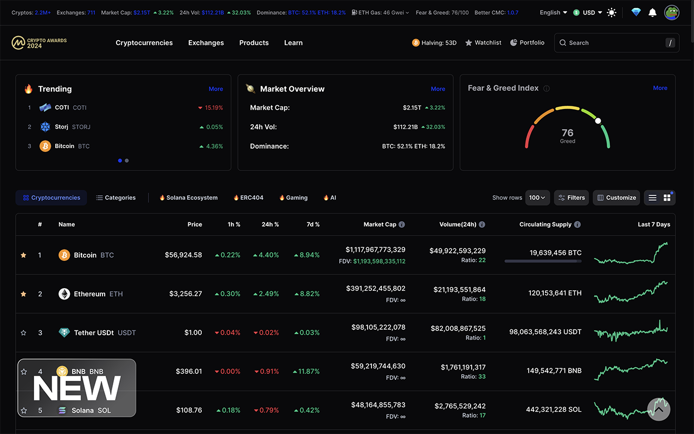

# Better CoinMarketCap Extension

Enhance your CoinMarketCap experience with "Better CoinMarketCap," a Chrome extension that simplifies and improves the website's interface by removing ads, community sections filled with scams, and other unnecessary elements, and now including a feature to visually analyze the market cap to volume ratio of cryptocurrencies.

## Features

- **Clean Interface:** Experience CoinMarketCap without the clutter of community sections and ads.
- **Market Cap to Volume Ratio:** Calculate and display the market cap to volume ratio for each cryptocurrency, with a color indicator to quickly identify if a crypto's market cap is inflated or if its volume is too low compared to its market cap. This feature helps in finding cryptocurrencies that may have an inflated market cap, providing a valuable tool for better investment decisions.
- **Modern Design:** Enjoy a modernized and intuitive design for easier navigation.
- **Open Source:** Full transparency with an open-source codebase on GitHub.

## Screenshots

Below are some before and after screenshots to give you a feel for the enhancements "Better CoinMarketCap" brings to your browsing experience, including the new market cap to volume ratio feature.

### Homepage View
Before | After
:---:|:---:
 | 

### Coin Page View
Before | After
:---:|:---:
 | 

## Installation

To install "Better CoinMarketCap," simply add the extension to your Chrome browser from the Chrome Web Store. The enhancements will be automatically applied to CoinMarketCap.com.

## Usage

Once installed, the extension will automatically apply the new styles and functionalities to CoinMarketCap.com. There's no need for any additional setup or configuration.

## Support

For support, questions, or more information, please visit [our GitHub issues page](https://github.com/Decryptu/Better-CoinMarketCap/issues).

## Contributing

Contributions are welcome! Please check out our [contribution guidelines](CONTRIBUTING.md).

## License

This project is licensed under the [MIT License](LICENSE).

## Disclaimer

This Chrome extension is not affiliated with, endorsed, or sponsored by CoinMarketCap. All trademarks belong to their respective owners.

---

Enjoy a better CoinMarketCap with less noise and more focus on the data that matters to you, including insightful analysis on market cap and volume ratios.